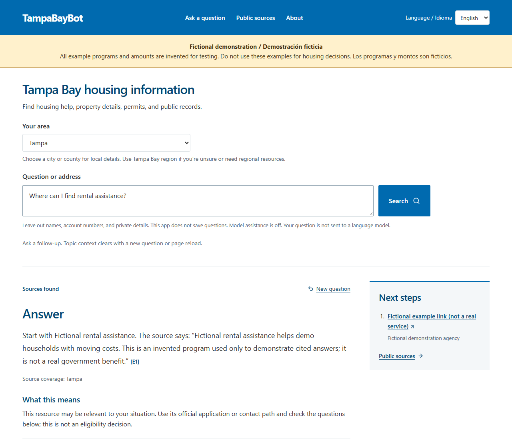

# Offline fictional demo

After [local setup](DEVELOPMENT.md#local-setup), run:

```sh
npm run demo
```

Open http://localhost:3001. Choose Tampa and ask “Where can I find rental assistance?” The banner labels every example as fictional. Programs, amounts and publisher links are invented, original test content; they do not describe real benefits. Model assistance is disabled. Live address tools remain separate and disclose their external requests.

The command serves a new isolated directory under `work/releases/` using installed dependencies. It preserves your registry, evidence, environment files and reports. Stop with Ctrl+C; choose another port with `npm run demo -- --port 3002`.

For demo browser checks, install Chromium with `npx playwright install chromium`, then run `npm run test:source:browser`. It creates its own isolated demo on port 3112. See the [development command reference](DEVELOPMENT.md#commands-and-evidence-prerequisites) for source and corpus tests; synthetic passes do not establish source freshness, human usefulness or regional coverage.



To refresh this screenshot, set `TAMPABAYBOT_CAPTURE_DEMO=1` for `npm run test:source:browser`. The desktop keyboard/citation test writes `docs/images/demo.png`; inspect the image before committing it. In PowerShell:

```powershell
$env:TAMPABAYBOT_CAPTURE_DEMO = '1'
npm.cmd run test:source:browser
Remove-Item Env:TAMPABAYBOT_CAPTURE_DEMO
```
